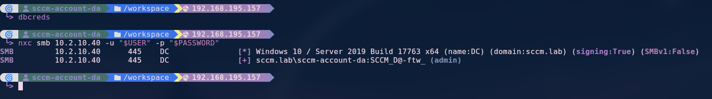

# 📂 Exegol-history
Exegol-history is a tool to quickly store and retrieve compromised credentials and hosts; the goal is to ease the management of credentials and hosts during a penetration testing engagement or a CTF.

Once an asset is selected from the TUI, the information can be accessed through environment variables and doesn't need to be typed over and over.

## ✨ Features
- Add / edit / delete credentials and hosts informations trough a CLI or a TUI
- Import / export in various format (CSV, Pypykatz, ...)
- Keybinds customisation

## 🖼️ Screenshots
The TUI (Terminal User Interface):


A typical workflow with `Exegol-history`:


## ⚙️ Install
`Exegol-history` is already installed in an Exegol container, however you can install it manually if you want.

### 1. Install the package
<details>
<summary>Uv</summary>

```sh
uv tool install git+https://github.com/ThePorgs/Exegol-history
```
</details>

<details>
<summary>Pipx</summary>

```sh
pipx install git+https://github.com/ThePorgs/exegol-history
```
</details>

### 2. Set up your shell to use `exh`

<details>
<summary>Zsh</summary>

Add this to your `.zrshrc`:
```sh
function exh { 
    exegol-history "$@" && exec zsh 
}
source /opt/tools/Exegol-history/profile.sh
```
</details>

<details>
<summary>PowerShell</summary>

Add this to your Powershell `$PROFILE`:
```powershell
function exh {
    exegol-history $Args; if($?) { . $profile }
}
. C:\Program Files\Exegol-history\profile.ps1
```
</details>

### 3. Set up your prompt to display variables (optional)
To see which user you are currently using, you can add the `USER` and `DOMAIN` environnment variable to your prompt.

<details>
<summary>Starship</summary>

Add this to your `Starship` config:
```toml
[env_var]
variable = "USER"
default = ''
style = "fg:bold red bg:#477069"
format = '[  $env_value ]($style)'
```
</details>

<details>
<summary>Zsh</summary>

Add this to your `.zshrc`:
```sh
update_prompt() {
    DB_PROMPT=""

    if [[ ! -z "${USER}" ]]; then
      DB_PROMPT="%{$fg[white]%}[%{$fg[yellow]%}${USER}%{$fg[white]%}]%{$reset_color%}"
    fi

    if [[ ! -z "${DOMAIN}" && ! -z "${USER}" ]]; then
      DB_PROMPT="%{$fg[white]%}[%{$fg[yellow]%}${USER}@${DOMAIN}%{$fg[white]%}]%{$reset_color%}"
    fi

    PROMPT="$DB_PROMPT$(prompt_char) "
  }

add-zsh-hook precmd update_prompt
```
</details>

### 4. Modify your `exh` config file
You might need to modify the `profile_sh_path` directive to match with what you put in the step 2.

## 📝 Configuration
A small configuration file `config.toml` can be used to customise the database name,keybinds and theme for the TUI:
```toml
[paths]
db_name = "DB.kdbx"
db_key_name = "db.key"
profile_sh_path = "/opt/tools/Exegol-history/profile.sh"

# Keybinds list: https://github.com/Textualize/textual/blob/8f85ece761031a756a1ecfa345b519c9c915e04b/src/textual/keys.py#L9
[keybindings]
copy_username_clipboard = "f1"
copy_password_clipboard = "f2"
copy_hash_clipboard = "f3"
add_credential = "f4"
delete_credential = "f5"
edit_credential = "f6"
export_credential = "f7"
copy_ip_clipboard = "f1"
copy_hostname_clipboard = "f2"
add_host = "f3"
delete_host = "f4"
edit_host = "f5"
export_host = "f6"
quit = "ctrl+c"

[theme]
primary = "#0178D4"
secondary = "#004578"
accent = "#ffa62b"
foreground = "#e0e0e0"
# background = ""
success = "#4EBF71"
warning = "#ffa62b"
error = "#ba3c5b"
# surface = ""
# panel = ""
dark = true
clipboard_icon = "📋"
add_icon = "➕"
delete_icon = "🗑️"
edit_icon = "📝"
export_icon = "📤"
```

**The configuration file must be in the home folder, in a `.exegol-history` folder.**

## 💡 Tips & tricks

### ⌨️ Keybind
You can add a keybind that will automatically type the command to launch the **Exegol-history** TUI, for example using the [Kitty](https://github.com/kovidgoyal/kitty) terminal, you can add a keybind like this:
```
map ctrl+u 'remote_control send-text "exh set creds\\n"'
```
pushing the **ctrl+u** key combination should automatically open the TUI without having to type `exh set creds`.

## 📖 Examples
```sh
# Interactively select a credential
exh set creds

# Show the current environnment variables
exh show

# Add a credential
exh add creds -u 'Administrator' -p 'Passw0rd!'

# Add a credential with a password, a hash and a domain
exh add creds -u 'Administrator' -p 'Passw0rd!' -H 'FC525C9683E8FE067095BA2DDC971889' -d 'test.local'

# Import multiple credentials from a CSV file
exh import creds --file creds.csv --format CSV

# Delete the credential with the id 1
exh rm creds --id 1

# Add a host
exh add hosts --ip '127.0.0.1'

# Add a host with a hostname and a role
exh add hosts --ip '127.0.0.1' -n 'dc.test.local' -r 'DC'

# Import multiple hosts from a CSV file
exh import hosts --file hosts.csv --format CSV

# Export hosts in CSV format
exh export hosts --format CSV

# Delete the host with the id 1
exh rm hosts --id 1
```

## 📥 Importing credential
| Name  | Status |
| ------------- | ------------- |
| CSV | ✅  |
| JSON  | ✅  |
| Keepass KDBX  | ✅  |
| Pypykatz (JSON)  | ✅  |
| Secretsdump  | ✅  |
| Lsassy  | ❌  |
| Masky  | ❌  |
| Gosecretsdump  | ❌  |
| Certsync  | ❌  |
| Dploot  | ❌  |
| PassTheCert  | ❌  |
| Pcredz  | ❌  |

## 📥 Importing hosts
| Name  | Status |
| ------------- | ------------- |
| CSV | ✅  |
| JSON  | ✅  |

## 📤 Exporting credential
| Name  | Status |
| ------------- | ------------- |
| CSV  | ✅  |
| JSON  | ✅  |

## 📤 Exporting hosts
| Name  | Status |
| ------------- | ------------- |
| CSV  | ✅  |
| JSON  | ✅  |

## 🔄 Synchronizing
| Name  | Status |
| ------------- | ------------- |
| Metasploit Database  | 🚧  |
| NetExec  | 🚧  |
| Cobalt Strike  | ❌  |
| Havoc  | ❌  |
| Sliver  | ❌  |
| Bloodhound | ❌  |
| Crackhound  | ❌  |
| DonPAPI  | ❌  |
| Hashcat  | ❌  |

## 🛠 Development and contribution
All pull request must be targeting the `dev` branch, all contributions are welcome, it is recommended to use `poetry` to set up a development environement.

### Running tests
```sh
poetry run pytest
```

### Installing using `poetry`
```sh
git clone https://github.com/ThePorgs/Exegol-history.git
poetry install --all-groups
poetry run python exegol-history.py
```